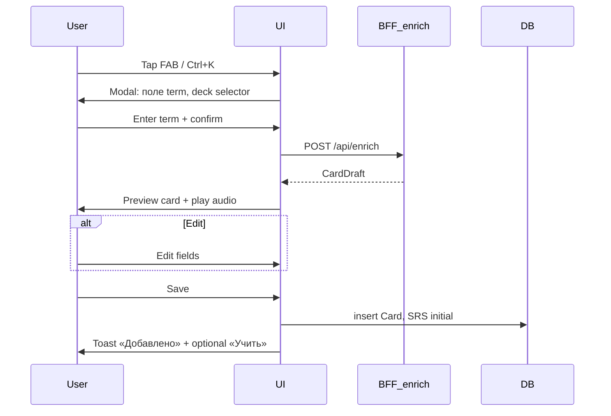
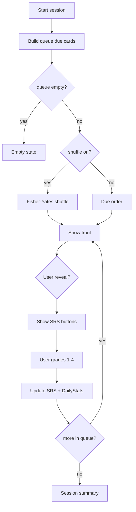

# UX/UI Specification — Click&Speak

**Версия:** 1.0.0  
**Дата:** 2026-05-23  
**Design system:** [design-system.md](./design-system.md)  
**PRD:** [01-product-vision-prd.md](./01-product-vision-prd.md)

---

## 1. Information Architecture

### 1.1 Карта маршрутов

```
/                          → Dashboard
/learn                     → Review session (query: deckId, mode)
/decks                     → Deck list & management
/decks/[deckId]            → Deck detail (cards list)
/decks/[deckId]/edit       → Edit deck metadata
/statistics                → Progress & activity
/settings                  → User preferences, export/import
```

### 1.2 Глобальная навигация

| Пункт | Route | Иконка | Мокап |
|-------|-------|--------|-------|
| Dashboard | `/` | `dashboard` | linguist_dashboard |
| Learn | `/learn` | `school` | learning_mode |
| Decks | `/decks` | `style` | my_decks |
| Statistics | `/statistics` | `query_stats` | progress_statistics |

**Desktop:** боковая панель 256px, sticky.  
**Mobile (&lt;768px):** bottom tab bar, 4 пункта; sidebar скрыт.

### 1.3 Глобальные элементы

| Элемент | Desktop | Mobile | MVP |
|---------|---------|--------|-----|
| Search | Top bar, full-width max 480px | Icon → expand overlay | Decks + global word search |
| Quick Add FAB | Fixed bottom-right OR header chip | FAB 56px | Must |
| Profile | Avatar only (no Pro badge) | Same | No account — settings avatar placeholder |
| Notifications | — | — | **Hidden** (out of scope) |
| History | — | — | **Hidden** (out of scope) |

---

## 2. Матрица: экран → мокап → MVP

### 2.1 Dashboard

**Референс:** `stitch_linguo_vocab_flashcards/linguist_dashboard/code.html`

| Блок мокапа | MVP | Примечание |
|-------------|-----|------------|
| Hero «Ready for your daily session?» | ✅ | Текст RU; CTA «Начать обучение» |
| Secondary «Review Flashcards» | ✅ | → `/learn?mode=review` |
| Growth ring 75% | ✅ | Daily goal completion |
| Words mastered / goal | ✅ | Из DailyStats |
| Grid deck cards (3) | ✅ | До 6 колод, сортировка по lastStudied |
| Word of the Day | ❌ | Phase 2 |
| Flash Streak Bonus / 2x XP | ❌ | Out of scope |
| «Pro Learner» label | ❌ | Убрать |
| Sidebar New Deck | ✅ | Дублирует Decks CTA |

**Пустое состояние:** нет колод → иллюстрация + «Создайте первую колоду» + CTA.

### 2.2 Decks (Deck Management)

**Референс:** `stitch_linguo_vocab_flashcards/my_decks/code.html`

| Блок | MVP | Примечание |
|------|-----|------------|
| Global mastery 64% | ✅ | Агрегат по всем колодам |
| Daily goal card | ✅ | «Осталось N слов сегодня» |
| Import CSV | ✅ | |
| Add New Deck | ✅ | Modal или `/decks/new` |
| Active Decks table | ✅ | Columns: name, language tag, cards, mastery bar, last studied, actions |
| Filter / Sort icons | Should | Sort must; filter Phase 2 |
| Pagination | Should | Если &gt; 20 колод |
| AI-Powered Decks banner | ❌ | Out of scope |
| Search decks/vocabulary | ✅ | |

**Deck detail (`/decks/[id]`):** не в отдельном мокапе — список карточек таблицей/списком, кнопки Add card, Quick Add, Study, Edit deck.

### 2.3 Learn (Learning Mode)

**Референс:** `stitch_linguo_vocab_flashcards/learning_mode/code.html`

| Блок | MVP | Примечание |
|------|-----|------------|
| Breadcrumb deck / session type | ✅ | «Advanced Spanish / Повторение» |
| Streak badge header | ✅ | Days only, no XP |
| Session progress bar | ✅ | `current / total` |
| Flip flashcard | ✅ | Tap or Space |
| volume_up | ✅ | TTS target language |
| SRS 4 buttons + interval labels | ✅ | |
| Keyboard hints Space, 1-4 | ✅ | Desktop only |
| Collapsed sidebar 80px | ✅ | Desktop Learn |
| Shuffle toggle | ✅ | **Добавить** в header session |
| Exit session | ✅ | **Добавить** — confirm dialog |
| Empty due queue | ✅ | **Добавить** empty state |

**Mobile Learn:** full viewport, no sidebar; bottom SRS bar sticky; progress top.

### 2.4 Statistics

**Референс:** `stitch_linguo_vocab_flashcards/progress_statistics/code.html`

| Блок | MVP | Примечание |
|------|-----|------------|
| Weekly goal ring | ✅ | |
| Daily activity 7 bars | ✅ | |
| Period toggle Last 7 Days | Should | |
| Download Report | ❌ | |
| Mastery Breakdown Grammar/Listening/… | ❌ | Только vocabulary aggregate |
| Words Learned line chart 30d | Should | |
| Linguistic Elite badge | ❌ | |
| Recent milestones (streak, time, accuracy) | ✅ | Без «Stories Read» |
| +12% trending | Should | Если есть данные прошлой недели |

### 2.5 Settings

**Референс:** нет отдельного мокапа — минимальная форма.

Секции:

1. Языки (native, learning)  
2. Daily goals (new cards, reviews)  
3. Shuffle default  
4. TTS voice (dropdown)  
5. Data: Export JSON, Import JSON, Clear all (danger)

---

## 3. User flows

### 3.1 Quick Add (ключевой)



**Состояния UI:**

| State | UI |
|-------|-----|
| idle | Input enabled |
| loading | Skeleton card + spinner |
| preview | Full card editable |
| partial_error | Yellow banner «Часть полей не заполнена» + empty fields highlighted |
| error | Red banner + retry |

**Entry points:** FAB (global), кнопка на `/decks/[id]`, shortcut `Ctrl+K` (desktop).

### 3.2 Review session



**Session summary screen:** cards reviewed, again count, time spent, CTA «На главную».

### 3.3 Create deck

1. Tap «Новая колода»  
2. Modal: title*, sourceLang*, targetLang*, description  
3. Save → redirect `/decks/[id]`  
4. Prompt Quick Add first card (optional tooltip)

### 3.4 Import CSV

1. Decks → Import CSV  
2. Select file + target deck (or create new)  
3. Preview first 5 rows  
4. Confirm → progress → result (imported / skipped)

---

## 4. Wireframe-level layout

### 4.1 Desktop (≥1024px)

```
+------------------+----------------------------------------+
| SideNav 256px    | TopBar: search | Quick Add | avatar   |
|                  +----------------------------------------+
| Dashboard        | Content max-w-container px-xl          |
| Learn            |                                        |
| Decks            |                                        |
| Statistics       |                                        |
|                  |                                        |
| [New Deck]       |                                        |
| Settings         |                                        |
+------------------+----------------------------------------+
```

### 4.2 Mobile (&lt;768px)

```
+----------------------------------+
| TopBar: title | FAB              |
+----------------------------------+
|                                  |
|         Content                  |
|                                  |
+----------------------------------+
| [Dash][Learn][Decks][Stats]      |
+----------------------------------+
```

**Learn mobile:** TopBar minimal (exit ←, progress); no bottom nav during session (fullscreen).

---

## 5. Компонентная библиотека

| Component | Props (ключевые) | Used in |
|-----------|------------------|---------|
| `AppShell` | `variant: default \| learn` | All |
| `SideNav` | `activePath` | Desktop |
| `BottomNav` | `activePath` | Mobile |
| `TopBar` | `showSearch`, `title` | Decks, Dashboard |
| `DeckCard` | `deck`, `onStudy` | Dashboard |
| `DeckTable` | `decks`, `onEdit`, `onDelete`, `onStudy` | Decks |
| `Flashcard` | `card`, `flipped`, `onFlip` | Learn |
| `SRSButtonGroup` | `onRate`, `disabled` | Learn |
| `SessionProgress` | `current`, `total` | Learn |
| `StatRing` | `value`, `max`, `label` | Dashboard, Statistics |
| `ActivityChart` | `data: {day, count}[]` | Statistics |
| `QuickAddModal` | `open`, `defaultDeckId` | Global |
| `ConfirmDialog` | `title`, `onConfirm` | Delete, exit session |
| `EmptyState` | `icon`, `title`, `action` | All lists |
| `Toast` | `message`, `variant` | Global feedback |

---

## 6. Responsive breakpoints

| Name | Width | Layout changes |
|------|-------|----------------|
| mobile | 0–767px | BottomNav, single column, `headline-lg-mobile` |
| tablet | 768–1023px | Sidebar optional collapse; 2-col deck grid |
| desktop | 1024+ | Sidebar 256px, 3-col deck grid, keyboard shortcuts |

**Touch targets:** minimum 44×44px on mobile for all interactive elements.

---

## 7. Copy & language

- **UI language MVP:** русский.  
- **Card content:** языки колоды (term в `sourceLang`, translation в `targetLang`).  
- **Мокапы на EN** — использовать RU строки в реализации (таблица ниже).

| Mockup (EN) | Production (RU) |
|-------------|-----------------|
| Start Learning | Начать обучение |
| Review Flashcards | Повторить карточки |
| TAP TO REVEAL MEANING | Нажмите, чтобы увидеть перевод |
| Again / Hard / Good / Easy | Снова / Сложно / Хорошо / Легко |
| New Deck | Новая колода |
| Deck Management | Мои колоды |

---

## 8. Accessibility

| Requirement | Implementation |
|-------------|----------------|
| Focus order Learn | Card → Audio → Again → Hard → Good → Easy → Exit |
| Flip announcement | `aria-live="polite"` «Показан перевод» |
| SRS buttons | `aria-label="Снова, интервал 1 минута"` |
| Color contrast | WCAG AA body text on background |
| Keyboard | Space, 1–4, Escape = exit confirm |
| Reduced motion | `prefers-reduced-motion`: disable flip 3D, fade instead |

---

## 9. Error & empty states

| Context | Message (RU) | Action |
|---------|--------------|--------|
| No decks | У вас пока нет колод | Создать колоду |
| No due cards | На сегодня повторений нет | Учить новые / Другая колода |
| Enrich failed | Не удалось загрузить данные | Повторить / Заполнить вручную |
| Offline (enrich) | Нужен интернет для Quick Add | OK |
| Delete deck | Удалить колоду «{name}»? Все карточки будут потеряны. | Удалить / Отмена |

---

## 10. Screenshot reference index

| Screen | File |
|--------|------|
| Dashboard | `../stitch_linguo_vocab_flashcards/linguist_dashboard/code.html` |
| Decks | `../stitch_linguo_vocab_flashcards/my_decks/code.html` |
| Learn | `../stitch_linguo_vocab_flashcards/learning_mode/code.html` |
| Statistics | `../stitch_linguo_vocab_flashcards/progress_statistics/code.html` |
| Tokens | `../stitch_linguo_vocab_flashcards/linguistic_clarity/DESIGN.md` |

Открыть локально в браузере для pixel-ориентира; допуск ±4px по spacing scale.

---

## 11. Связанные документы

- [design-system.md](./design-system.md)  
- [07-acceptance-criteria.md](./07-acceptance-criteria.md)  
- [04-data-model.md](./04-data-model.md)
