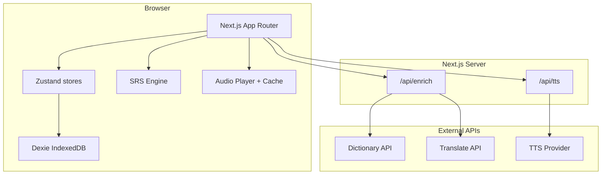
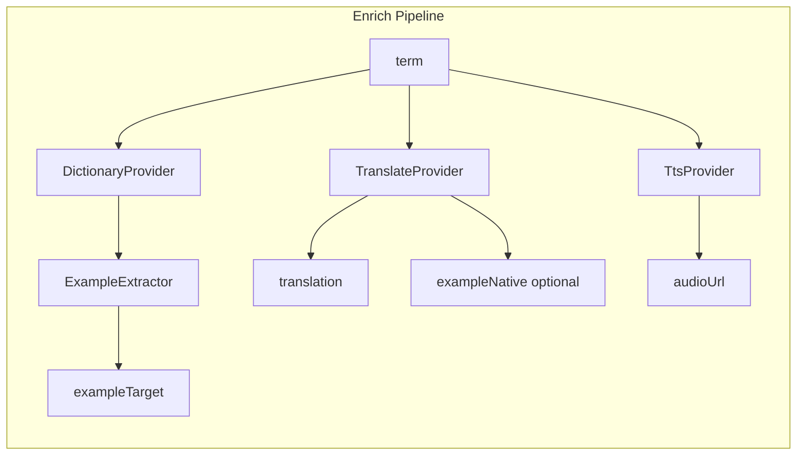
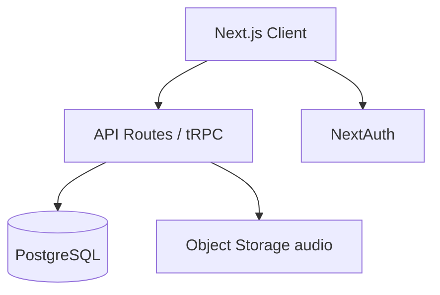

# Architecture — Click&Speak

**Версия:** 1.0.0  
**Дата:** 2026-05-23

---

## 1. Обзор

Click&Speak MVP — **client-heavy SPA** на Next.js с **local-first** хранением (IndexedDB). Серверные Route Handlers используются как **BFF proxy** для внешних API (enrichment, TTS), чтобы не раскрывать ключи в браузере.



---

## 2. Технологический стек

| Слой | Технология | Версия (ориентир) |
|------|------------|-------------------|
| Framework | Next.js App Router | 15.x |
| UI | React | 19.x |
| Language | TypeScript | 5.x |
| Styling | Tailwind CSS | 3.4+ |
| Client DB | Dexie.js | 4.x |
| State | Zustand | 5.x |
| Validation | Zod | 3.x |
| Testing | Vitest + Playwright | latest |
| Deploy | Vercel | — |

**Phase 2:** PostgreSQL, Prisma/Drizzle, NextAuth or Clerk, Redis (optional queue for TTS).

---

## 3. Структура репозитория (целевая)

```
Click&Speak/
├── docs/
├── stitch_linguo_vocab_flashcards/   # UI reference only
├── apps/
│   └── web/
│       ├── app/
│       │   ├── (main)/
│       │   │   ├── page.tsx              # Dashboard
│       │   │   ├── learn/page.tsx
│       │   │   ├── decks/
│       │   │   ├── statistics/page.tsx
│       │   │   └── settings/page.tsx
│       │   ├── api/
│       │   │   ├── enrich/route.ts
│       │   │   └── tts/route.ts
│       │   └── layout.tsx
│       ├── components/
│       │   ├── ui/                       # primitives
│       │   └── features/                 # domain components
│       ├── features/
│       │   ├── decks/
│       │   ├── cards/
│       │   ├── learn/
│       │   ├── quick-add/
│       │   └── statistics/
│       ├── lib/
│       │   ├── db/                       # Dexie schema
│       │   ├── srs/                      # algorithm
│       │   ├── enrichment/               # providers
│       │   ├── audio/
│       │   └── i18n/
│       ├── stores/
│       └── tailwind.config.ts
├── package.json
└── README.md
```

---

## 4. Слои приложения

### 4.1 Presentation (`app/`, `components/`)

- Server Components для статичных layout shell где возможно.  
- Client Components для Learn, Quick Add, интерактивных списков (`"use client"`).  
- Route groups `(main)` с общим `AppShell`.

### 4.2 Feature modules (`features/`)

| Module | Ответственность |
|--------|-----------------|
| `decks` | CRUD колод, список, поиск |
| `cards` | CRUD карточек, CSV import |
| `quick-add` | Modal, enrichment orchestration |
| `learn` | Session queue, flip, grade |
| `statistics` | Агрегация DailyStats, charts |

### 4.3 Domain (`lib/srs`, `lib/db`)

- Чистая логика SRS без React.  
- Репозитории поверх Dexie: `deckRepo`, `cardRepo`, `settingsRepo`, `statsRepo`.

### 4.4 Infrastructure (`lib/enrichment`, `app/api`)

- HTTP clients с timeout, retry (1x), circuit breaker (Phase 2).  
- Маппинг внешних ответов → `CardDraft` (Zod).

---

## 5. Потоки данных

### 5.1 Quick Add

1. `QuickAddModal` → `enrichmentService.enrich(term, sourceLang, targetLang)`  
2. Client `POST /api/enrich` → server orchestrates dictionary + translate  
3. Parallel `GET /api/tts?text=&lang=` → audio URL or base64  
4. User saves → `cardRepo.create()` + initial SRS state  
5. Optional: `audioCache.store(cardId, blob)`

### 5.2 Review session

1. `learnService.buildQueue({ deckId?, mode, shuffle })`  
2. Query Dexie: `dueAt <= now`, sort by `dueAt ASC`  
3. On grade → `srs.applyGrade(card, grade)` → `cardRepo.update`  
4. `statsRepo.recordReview(card, grade, duration)`  
5. Update streak if first activity today

### 5.3 Export / Import

- Export: serialize `decks`, `cards`, `settings`, `dailyStats` → JSON file download.  
- Import: validate schema Zod → merge or replace (user choice).

---

## 6. Enrichment architecture



**Interface (TypeScript):**

```typescript
interface EnrichmentProvider {
  name: string;
  supports(sourceLang: string, targetLang: string): boolean;
}

interface DictionaryProvider extends EnrichmentProvider {
  lookup(term: string, lang: string): Promise<{
    phonetic?: string;
    partOfSpeech?: string;
    definitions: { example?: string; meaning: string }[];
  }>;
}

interface TranslateProvider extends EnrichmentProvider {
  translate(text: string, from: string, to: string): Promise<string>;
}

interface TtsProvider extends EnrichmentProvider {
  synthesize(text: string, lang: string, voiceId?: string): Promise<{ url: string } | { blob: Blob }>;
}
```

**MVP provider selection:** по языковой паре в config; fallback chain documented in [05-api-spec.md](./05-api-spec.md).

---

## 7. SRS module

- Расположение: `lib/srs/`  
- Вход: `Card`, `Grade` (`again` | `hard` | `good` | `easy`)  
- Выход: обновлённые SRS-поля + human-readable `nextIntervalLabel`  
- Unit tests обязательны (100% branch coverage на формулы)

См. [04-data-model.md](./04-data-model.md) § SRS.

---

## 8. Audio

| Concern | Approach |
|---------|----------|
| Playback | HTML5 `Audio` or Web Audio API |
| Cache | IndexedDB table `audioBlobs` keyed by `cardId` |
| Preload | On card show in Learn, prefetch audio |
| Fallback | Web Speech API if TTS fails; UI badge «Браузер» |

---

## 9. Security

| Topic | MVP |
|-------|-----|
| API keys | Только `process.env` на server routes |
| CORS | Same-origin |
| XSS | React escaping; sanitize markdown if added later |
| CSP | default-src 'self'; img https:; connect API domains |
| User data | Local; no PII required |
| Rate limit BFF | 60 req/min per IP (Vercel middleware) |

---

## 10. Observability (MVP light)

- Client: `console.error` + optional Sentry (Phase 2).  
- Server routes: structured log `{ route, durationMs, status }` без term в plaintext.  
- Analytics: privacy-friendly events (session_completed, card_added) — opt-in Phase 2.

---

## 11. Deployment

| Env | URL | Notes |
|-----|-----|-------|
| dev | localhost:3000 | `.env.local` |
| preview | Vercel PR | Preview env vars |
| prod | TBD | Custom domain HTTPS |

**Env variables:**

```
DEEPL_API_KEY=
AZURE_TTS_KEY=
AZURE_TTS_REGION=
DICTIONARY_API_KEY=          # if needed
```

---

## 12. Phase 2 architecture delta



- Sync: `POST /api/sync` with lastSync timestamp, conflict resolution LWW on `updatedAt`.  
- TTS: generate once server-side, store URL in S3, CDN delivery.

---

## 13. ADR summary

| ID | Decision | Rationale |
|----|----------|-----------|
| ADR-001 | Local-first MVP | Speed to market, no auth complexity |
| ADR-002 | Next.js full-stack | Single repo, BFF for secrets |
| ADR-003 | Dexie over raw IDB | Schema versioning, queries |
| ADR-004 | Simplified SM-2 | Familiar Anki-like UX from mockups |
| ADR-005 | No LLM in MVP | Cost, latency, predictability |

---

## 14. Связанные документы

- [04-data-model.md](./04-data-model.md)  
- [05-api-spec.md](./05-api-spec.md)  
- [06-non-functional.md](./06-non-functional.md)
