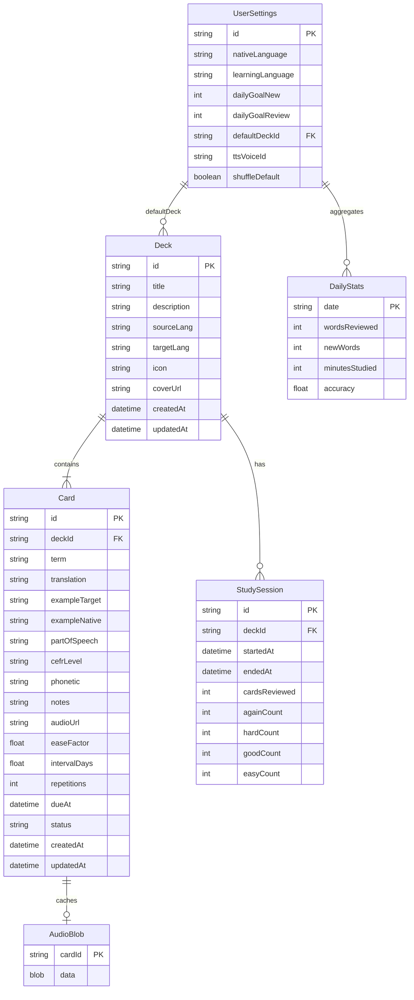

# Data Model — Click&Speak

**Версия:** 1.0.0  
**Дата:** 2026-05-23  
**Storage MVP:** IndexedDB via Dexie

---

## 1. ER-диаграмма



---

## 2. Сущности

### 2.1 UserSettings

Singleton document `id = "default"`.

| Поле | Тип | Обязательно | Описание |
|------|-----|-------------|----------|
| `id` | string | ✅ | Всегда `"default"` |
| `nativeLanguage` | string | ✅ | ISO 639-1, напр. `ru` |
| `learningLanguage` | string | ✅ | ISO 639-1, напр. `en` |
| `dailyGoalNew` | number | ✅ | Default 5 |
| `dailyGoalReview` | number | ✅ | Default 20 |
| `defaultDeckId` | string \| null | | Последняя/любимая колода |
| `ttsVoiceId` | string \| null | | ID голоса провайдера |
| `shuffleDefault` | boolean | ✅ | Default `true` |
| `updatedAt` | ISO datetime | ✅ | |

### 2.2 Deck

| Поле | Тип | Обязательно | Описание |
|------|-----|-------------|----------|
| `id` | uuid | ✅ | `crypto.randomUUID()` |
| `title` | string | ✅ | 1–120 символов |
| `description` | string | | До 500 символов |
| `sourceLang` | string | ✅ | Язык term |
| `targetLang` | string | ✅ | Язык translation |
| `icon` | string | | Material icon name, default `translate` |
| `coverUrl` | string \| null | | URL обложки |
| `createdAt` | ISO datetime | ✅ | |
| `updatedAt` | ISO datetime | ✅ | |

**Computed (не хранятся, вычисляются запросом):**

- `cardCount`: count cards where `deckId`  
- `masteryPercent`: % cards with `status === 'mastered'`  
- `lastStudiedAt`: max `Card.updatedAt` where reviewed in session  

### 2.3 Card

| Поле | Тип | Обязательно | Описание |
|------|-----|-------------|----------|
| `id` | uuid | ✅ | |
| `deckId` | uuid | ✅ | FK → Deck |
| `term` | string | ✅ | Слово/фраза (front) |
| `translation` | string | ✅ | Перевод (back) |
| `exampleTarget` | string | | Пример на sourceLang |
| `exampleNative` | string | | Перевод примера |
| `partOfSpeech` | string | | `noun`, `verb`, `adverb`, … |
| `cefrLevel` | string | | `A1`…`C2` |
| `phonetic` | string | | IPA или упрощённая |
| `notes` | string | | Пользовательские заметки |
| `audioUrl` | string \| null | | Remote URL TTS |
| `easeFactor` | number | ✅ | Default `2.5` |
| `intervalDays` | number | ✅ | Default `0` |
| `repetitions` | number | ✅ | Default `0` |
| `dueAt` | ISO datetime | ✅ | Default `now` (new card) |
| `status` | enum | ✅ | см. § 2.3.1 |
| `createdAt` | ISO datetime | ✅ | |
| `updatedAt` | ISO datetime | ✅ | |

#### 2.3.1 CardStatus

| Status | Условие |
|--------|---------|
| `new` | `repetitions === 0` и never reviewed |
| `learning` | `repetitions > 0` и `intervalDays < 21` |
| `review` | `intervalDays >= 21` и not mastered |
| `mastered` | `intervalDays >= 60` и `easeFactor >= 2.3` |

Переходы обновляются в `srs.applyGrade` после каждой оценки.

### 2.4 StudySession

| Поле | Тип | Описание |
|------|-----|----------|
| `id` | uuid | |
| `deckId` | uuid \| null | null = all decks |
| `mode` | `review` \| `new` \| `all` | |
| `startedAt` | ISO datetime | |
| `endedAt` | ISO datetime \| null | |
| `cardsReviewed` | number | |
| `againCount` | number | |
| `hardCount` | number | |
| `goodCount` | number | |
| `easyCount` | number | |

### 2.5 DailyStats

Primary key: `date` as `YYYY-MM-DD` (local timezone user).

| Поле | Тип | Описание |
|------|-----|----------|
| `date` | string | PK |
| `wordsReviewed` | number | Increment per grade |
| `newWords` | number | Cards created this day |
| `minutesStudied` | number | Session duration aggregate |
| `accuracy` | number | `(good+easy)/total` rolling |

### 2.6 AudioBlob (IndexedDB)

| Поле | Тип | Описание |
|------|-----|----------|
| `cardId` | string | PK |
| `data` | Blob | Cached audio |
| `mimeType` | string | `audio/mpeg` |
| `cachedAt` | ISO datetime | |

---

## 3. Dexie schema

```typescript
import Dexie, { type Table } from "dexie";

export class ClickSpeakDB extends Dexie {
  decks!: Table<Deck, string>;
  cards!: Table<Card, string>;
  settings!: Table<UserSettings, string>;
  studySessions!: Table<StudySession, string>;
  dailyStats!: Table<DailyStats, string>;
  audioBlobs!: Table<AudioBlob, string>;

  constructor() {
    super("ClickSpeakDB");
    this.version(1).stores({
      decks: "id, updatedAt, sourceLang",
      cards: "id, deckId, dueAt, status, [deckId+term]",
      settings: "id",
      studySessions: "id, deckId, startedAt",
      dailyStats: "date",
      audioBlobs: "cardId",
    });
  }
}
```

**Индексы:**

- `cards.dueAt` — очередь Review  
- `[deckId+term]` — unique constraint при импорте (application-level)  

---

## 4. SRS — алгоритм (упрощённый SM-2)

### 4.1 Начальное состояние (новая карточка)

```
easeFactor = 2.5
intervalDays = 0
repetitions = 0
dueAt = now()
status = 'new'
```

### 4.2 Grades

```typescript
type Grade = "again" | "hard" | "good" | "easy";
```

### 4.3 Псевдокод `applyGrade(card, grade, now)`

```typescript
const MIN_EASE = 1.3;
const EASY_BONUS = 1.3;
const HARD_FACTOR = 1.2;

function applyGrade(card: Card, grade: Grade, now: Date): Card {
  let { easeFactor, intervalDays, repetitions } = card;

  switch (grade) {
    case "again":
      repetitions = 0;
      intervalDays = 0;
      easeFactor = Math.max(MIN_EASE, easeFactor - 0.2);
      card.dueAt = addMinutes(now, 1);
      break;

    case "hard":
      repetitions += 1;
      intervalDays = Math.max(2, intervalDays * HARD_FACTOR);
      easeFactor = Math.max(MIN_EASE, easeFactor - 0.15);
      card.dueAt = addDays(now, intervalDays);
      break;

    case "good":
      repetitions += 1;
      if (repetitions === 1) {
        intervalDays = 1;
      } else if (repetitions === 2) {
        intervalDays = 3;
      } else {
        intervalDays = Math.round(intervalDays * easeFactor);
      }
      card.dueAt = addDays(now, intervalDays);
      break;

    case "easy":
      repetitions += 1;
      easeFactor += 0.15;
      if (repetitions === 1) {
        intervalDays = 4;
      } else {
        intervalDays = Math.round(intervalDays * easeFactor * EASY_BONUS);
      }
      card.dueAt = addDays(now, intervalDays);
      break;
  }

  card.easeFactor = easeFactor;
  card.intervalDays = intervalDays;
  card.repetitions = repetitions;
  card.status = deriveStatus(card);
  card.updatedAt = now.toISOString();
  return card;
}
```

### 4.4 UI labels (интервалы для подписи кнопок)

Вычисляются **прогнозом** при показе оборота (не влияют на логику):

| Кнопка | Label (RU) | Правило отображения |
|--------|------------|---------------------|
| Again | 1 мин | fixed |
| Hard | N дн | `max(2, round(intervalDays * 1.2))` |
| Good | N дн | next interval if good applied |
| Easy | N дн | next interval if easy applied |

### 4.5 Mastery расчёт

```
deck.masteryPercent = round(
  100 * count(cards where status === 'mastered') / count(cards)
)
```

Если `cardCount === 0` → `0%`.

---

## 5. JSON примеры

### 5.1 Deck

```json
{
  "id": "a1b2c3d4-e5f6-7890-abcd-ef1234567890",
  "title": "Advanced Spanish",
  "description": "Common phrases for daily conversation",
  "sourceLang": "es",
  "targetLang": "en",
  "icon": "translate",
  "coverUrl": null,
  "createdAt": "2026-05-23T10:00:00.000Z",
  "updatedAt": "2026-05-23T10:00:00.000Z"
}
```

### 5.2 Card

```json
{
  "id": "card-uuid-here",
  "deckId": "a1b2c3d4-e5f6-7890-abcd-ef1234567890",
  "term": "Aproximadamente",
  "translation": "Approximately",
  "exampleTarget": "Había aproximadamente cien personas.",
  "exampleNative": "There were approximately one hundred people.",
  "partOfSpeech": "adverb",
  "cefrLevel": "B2",
  "phonetic": "apɾoksimaˈmente",
  "notes": null,
  "audioUrl": "https://cdn.example/tts/abc.mp3",
  "easeFactor": 2.5,
  "intervalDays": 0,
  "repetitions": 0,
  "dueAt": "2026-05-23T10:00:00.000Z",
  "status": "new",
  "createdAt": "2026-05-23T10:00:00.000Z",
  "updatedAt": "2026-05-23T10:00:00.000Z"
}
```

### 5.3 CardDraft (enrichment response, pre-save)

```json
{
  "term": "aproximadamente",
  "translation": "approximately",
  "exampleTarget": "Había aproximadamente cien personas.",
  "exampleNative": "There were approximately one hundred people.",
  "partOfSpeech": "adverb",
  "cefrLevel": null,
  "phonetic": "apɾoksimaˈmente",
  "audioUrl": "https://..."
}
```

### 5.4 Export bundle

```json
{
  "version": 1,
  "exportedAt": "2026-05-23T12:00:00.000Z",
  "settings": { },
  "decks": [ ],
  "cards": [ ],
  "dailyStats": [ ]
}
```

---

## 6. CSV import format

```csv
term,translation,example
hello,привет,"Hello, how are you?"
world,мир,The world is big.
```

- Encoding: UTF-8 with BOM optional  
- Header row required  
- `example` → `exampleTarget`; `exampleNative` empty (user may edit)  
- Duplicate `term` in deck → **skip** (OQ-005)

---

## 7. Валидация (Zod sketches)

```typescript
const DeckSchema = z.object({
  id: z.string().uuid(),
  title: z.string().min(1).max(120),
  sourceLang: z.string().length(2),
  targetLang: z.string().length(2),
  // ...
});

const CardSchema = z.object({
  term: z.string().min(1).max(200),
  translation: z.string().min(1).max(500),
  easeFactor: z.number().min(1.3).max(3.0),
  status: z.enum(["new", "learning", "review", "mastered"]),
  // ...
});
```

---

## 8. Миграции

| Version | Changes |
|---------|---------|
| v1 | Initial schema |
| v2 (Phase 2) | `userId` on decks/cards for sync |

Dexie `version().upgrade()` для additive changes.

---

## 9. Связанные документы

- [03-architecture.md](./03-architecture.md)  
- [05-api-spec.md](./05-api-spec.md)  
- [07-acceptance-criteria.md](./07-acceptance-criteria.md)
