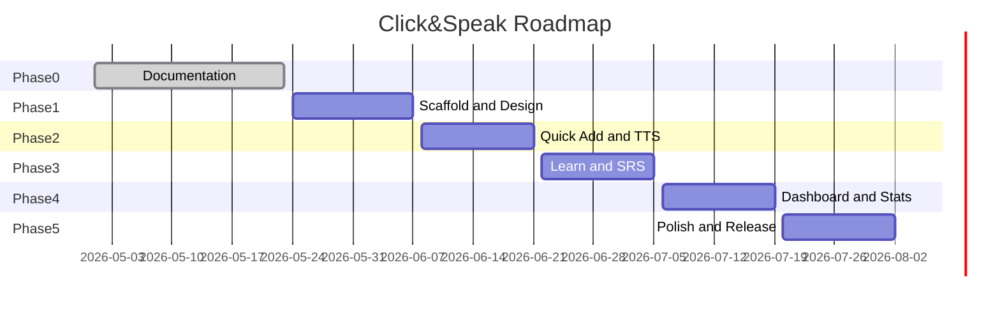
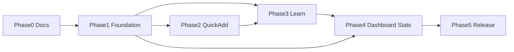

# Roadmap — Click&Speak

**Версия:** 1.0.0  
**Дата:** 2026-05-23  
**Горизонт:** MVP (v1.0) → v1.5 → v2.0

---

## 1. Обзор фаз

*Даты ориентировочные — уточняются после оценки команды.*

---

## 2. Phase 0 — Документация ✅

| Deliverable | Статус |
|-------------|--------|
| docs/ полный комплект | Done |
| MVP scope зафиксирован | Done |
| Design tokens documented | Done |
| Acceptance criteria | Done |

**Exit criteria:** PO sign-off на [01-product-vision-prd.md](./01-product-vision-prd.md) и [07-acceptance-criteria.md](./07-acceptance-criteria.md).

---

## 3. Phase 1 — Foundation (2 недели)

### Цели
- Репозиторий приложения, CI, Tailwind tokens
- Dexie schema, deck/card CRUD
- App shell + navigation

### Задачи

| ID | Task | Owner |
|----|------|-------|
| P1-1 | Init Next.js 15 + TS + Tailwind + ESLint | Dev |
| P1-2 | Port design tokens → `tailwind.config.ts` | Dev |
| P1-3 | Dexie v1 schema + repositories | Dev |
| P1-4 | AppShell: SideNav + BottomNav responsive | Dev |
| P1-5 | `/decks` list + create/edit/delete deck | Dev |
| P1-6 | `/decks/[id]` manual card CRUD | Dev |
| P1-7 | Settings page skeleton + language prefs | Dev |
| P1-8 | CI: lint, typecheck, vitest | Dev |

### Exit criteria
- [ ] Создание колоды и ручной карточки работает offline
- [ ] Navigation соответствует [02-ux-ui-spec.md](./02-ux-ui-spec.md)
- [ ] AC-DK-01, AC-DK-02 partial, AC-UI-03

---

## 4. Phase 2 — Quick Add + Audio (2 недели)

### Цели
- One-click enrichment E2E
- BFF `/api/enrich`, `/api/tts`
- Audio cache

### Задачи

| ID | Task | Owner |
|----|------|-------|
| P2-1 | Enrichment provider interfaces | Dev |
| P2-2 | Integrate Dictionary + DeepL (or fallback) | Dev |
| P2-3 | Azure TTS integration + voice map | Dev |
| P2-4 | BFF routes + rate limit | Dev |
| P2-5 | QuickAddModal UI + preview | Dev |
| P2-6 | Audio player + IndexedDB cache | Dev |
| P2-7 | Web Speech fallback + quality badge | Dev |
| P2-8 | E2E Quick Add tests | QA |

### Exit criteria
- [ ] AC-QA-01 through AC-QA-05 pass
- [ ] p50 enrich &lt; 3s (staging)

### Risks
| Risk | Mitigation |
|------|------------|
| TTS cost | Cache blobs; limit term length |
| API quota | Dev keys; queue Phase 2 |

---

## 5. Phase 3 — Learn + SRS (2 недели)

### Цели
- Review session complete
- SM-2 simplified engine
- Shuffle, keyboard shortcuts

### Задачи

| ID | Task | Owner |
|----|------|-------|
| P3-1 | `lib/srs` + unit tests 100% | Dev |
| P3-2 | Queue builder (due, modes) | Dev |
| P3-3 | Flashcard flip component | Dev |
| P3-4 | SRSButtonGroup + grade persistence | Dev |
| P3-5 | Session progress + summary | Dev |
| P3-6 | Shuffle toggle + Fisher-Yates | Dev |
| P3-7 | Exit confirm + session recovery | Dev |
| P3-8 | Learn E2E Playwright | QA |

### Exit criteria
- [ ] AC-LRN-01 through AC-LRN-09 pass
- [ ] 20-card session stable after refresh

---

## 6. Phase 4 — Dashboard + Statistics (2 недели)

### Цели
- Dashboard CTA flow
- Statistics MVP subset
- DailyStats aggregation

### Задачи

| ID | Task | Owner |
|----|------|-------|
| P4-1 | Streak calculation | Dev |
| P4-2 | Daily goal progress | Dev |
| P4-3 | Dashboard deck grid | Dev |
| P4-4 | Statistics charts (7d activity, weekly ring) | Dev |
| P4-5 | Global mastery aggregate | Dev |
| P4-6 | Remove OOS UI elements from templates | Dev |

### Exit criteria
- [ ] AC-DB-01 through AC-DB-05
- [ ] AC-ST-01 through AC-ST-03
- [ ] AC-OOS-* verified

---

## 7. Phase 5 — Import, Polish, Release (2 недели)

### Цели
- CSV import
- Export/import JSON
- a11y, performance, bug bash

### Задачи

| ID | Task | Owner |
|----|------|-------|
| P5-1 | CSV import + duplicate skip | Dev |
| P5-2 | Export/import settings bundle | Dev |
| P5-3 | i18n RU strings complete | Dev |
| P5-4 | axe fixes | Dev |
| P5-5 | Lighthouse optimization | Dev |
| P5-6 | Full regression AC checklist | QA |
| P5-7 | Production deploy Vercel | DevOps |
| P5-8 | Privacy notice (enrichment) | PO |

### Exit criteria
- [ ] All Must AC pass
- [ ] AC-NFR-01, AC-NFR-02, AC-NFR-03
- [ ] Sign-off table in 07-acceptance-criteria.md

---

## 8. Post-MVP (v1.5 / v2.0)

| Version | Theme | Features |
|---------|-------|----------|
| v1.5 | PWA | manifest, service worker, offline static |
| v1.5 | UX | Dark mode, onboarding, swipe gestures Learn |
| v2.0 | Cloud | Auth, sync, Postgres |
| v2.0 | Import | Anki .apkg, Quizlet |
| v2.0 | AI | LLM examples, CEFR detection |
| v2.0 | Media | Images on cards |

---

## 9. Зависимости

**External dependencies:**
- Azure / DeepL accounts provisioned before Phase 2  
- Vercel project + domain before Phase 5  

---

## 10. Риски и mitigations

| # | Risk | Impact | Probability | Mitigation |
|---|------|--------|-------------|------------|
| R1 | Scope creep from mockups | High | High | OOS checklist each PR |
| R2 | TTS latency | Medium | Medium | Cache, preload |
| R3 | IndexedDB quota | Medium | Low | Export warn at 80% |
| R4 | Safari audio autoplay | Medium | Medium | User gesture on play |
| R5 | Enrichment inaccuracy | Medium | High | Preview edit always |

---

## 11. Команда и роли (рекомендация)

| Role | Responsibility |
|------|----------------|
| Product Owner | Scope, sign-off, OQ resolution |
| Frontend Dev | UI, Dexie, Learn |
| Fullstack Dev | BFF, enrichment |
| QA | AC execution, E2E |
| Designer | Token QA vs mockups |

---

## 12. Definition of Done (global)

- [ ] Code reviewed, typed, linted  
- [ ] Unit tests for domain logic  
- [ ] AC IDs referenced in PR description  
- [ ] Docs updated if FR changed  
- [ ] No P0/P1 bugs open for feature  

---

## 13. Связанные документы

- [01-product-vision-prd.md](./01-product-vision-prd.md)  
- [07-acceptance-criteria.md](./07-acceptance-criteria.md)  
- [open-questions.md](./open-questions.md)
